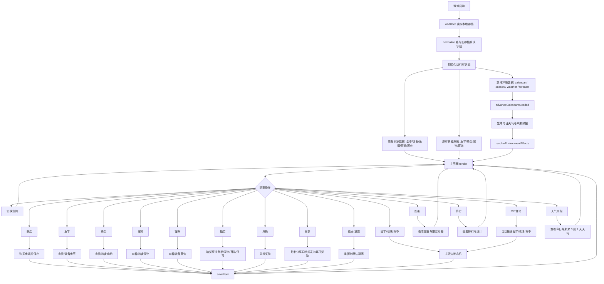
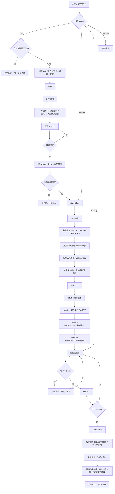
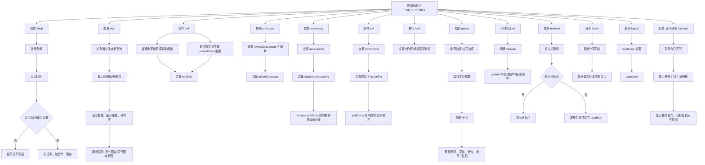
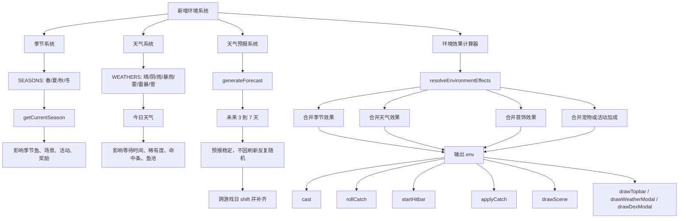
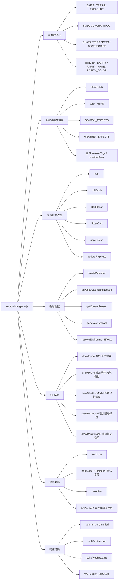
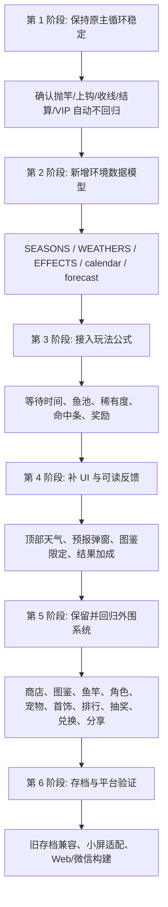

# 钓鱼游戏完整流程图（保留原流程 + 天气预报 + 季节）

这版是完整合并版：保留原有钓鱼主循环和外围系统（商店、图鉴、鱼竿、角色、宠物、首饰、排行、抽奖、VIP 自动、兑换、分享、退出、存档、构建发布），再新增天气系统、天气预报和季节系统。

## 1. 完整总览流程

## 2. 主玩法状态机（已接入天气和季节）

## 3. 原有外围系统流程（全部保留）

## 4. 天气、预报与季节新增流程

## 5. 数据与代码影响面

## 6. 推荐推进顺序

## 7. 完整验收清单

- 原有主玩法保留：抛竿、等待、上钩、收线、命中、失败、结算都能走通。
- 原有外围系统保留：商店、图鉴、鱼竿、角色、宠物、首饰、排行、抽奖、VIP 自动、兑换、分享、退出都能使用。
- 新增天气系统：晴、阴、雨、暴雨、雾、雷暴、雪都有明确效果和视觉反馈。
- 新增季节系统：春、夏、秋、冬能稳定推进，并影响鱼池、图鉴目标和场景表现。
- 新增天气预报：今日天气和未来预报稳定，不会每次刷新都变。
- 环境效果接入：`cast`、`rollCatch`、`startHitbar`、`applyCatch`、`drawScene`、`drawTopbar` 都能拿到一致的 `env`。
- 存档兼容：旧存档通过 `normalize` 补齐 `calendar`、`season`、`weather`、`forecast` 默认值。
- 数值验证：多天气、多季节抽样后，收益、难度、稀有鱼出现率不失控。
- 小屏验证：顶部按钮、预报弹窗、命中按钮、结果弹窗不遮挡。
- 构建验证：`npm run build:unified` 能成功生成 Web 与微信小游戏输出。
