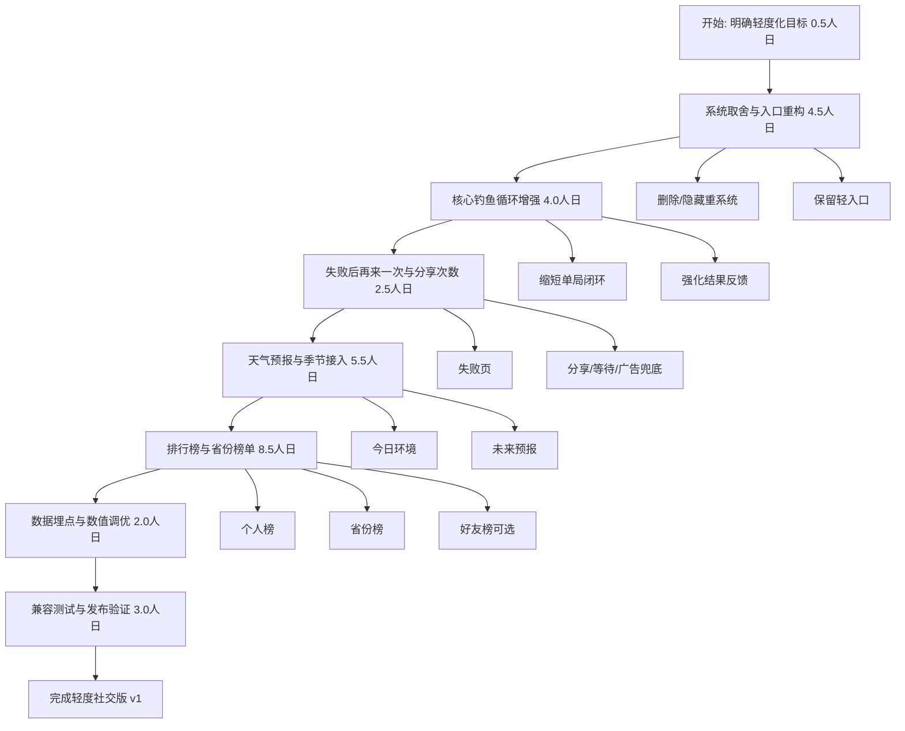
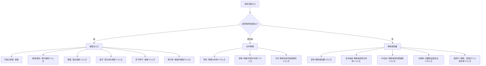
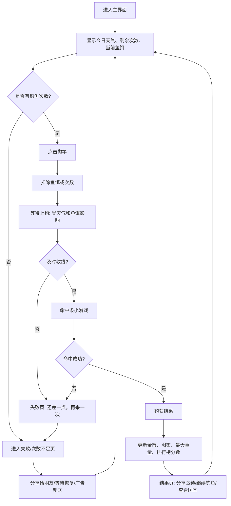
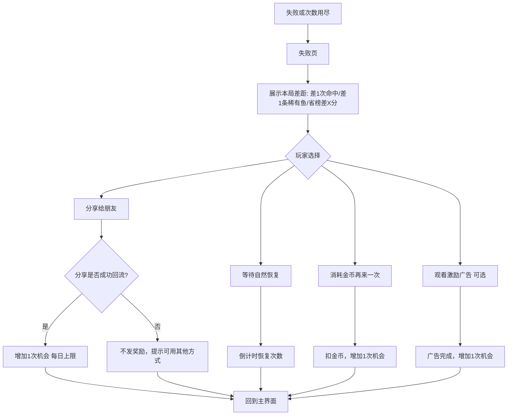
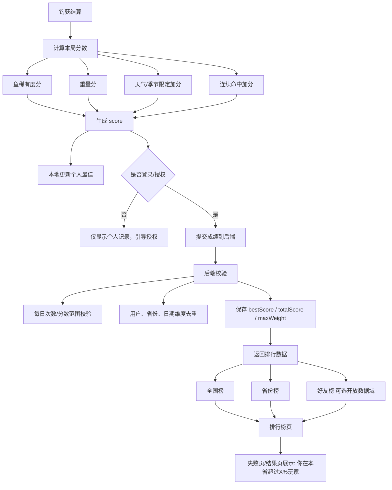

# 钓鱼游戏轻度化 + 社交排行榜优化流程图

目标：把游戏从多系统养成，收敛成“轻度钓鱼 + 图鉴收集 + 天气季节 + 失败后再来一次 + 省份排行榜”的完整闭环。

估算口径：

- 1 人日 = 8 人时。
- 默认 1 名熟悉当前项目的前端/小游戏开发者执行。
- 时间包含方案细化、代码修改、基础 UI、联调、自测。
- 不包含微信审核等待、服务器采购/备案、额外美术外包、复杂反作弊。
- 省份排行榜按“真实线上榜”估算；如果只做本地模拟榜，可减少约 4 到 6 人日。

## 1. 完整优化总流程

## 2. 外围系统取舍流程

## 3. 轻度核心单局流程

## 4. 失败后分享获取次数流程

> 注意：这个流程建议做成“可选补充次数”，不要做成唯一继续方式。为了降低审核风险，失败后应至少提供一种非分享路径，比如自然恢复、每日免费次数、激励广告或消耗游戏内金币。

## 5. 排行榜与省份榜单流程

## 6. 逐项人工时间清单

| 阶段 | 任务 | 产出 | 预估人时 | 预估人日 |
|---|---|---|---:|---:|
| 0 | 轻度化目标确认 | 最终保留/删除清单、核心指标 | 4h | 0.5d |
| 1 | 顶部入口重构 | 入口从 12 个收敛到 5 到 6 个 | 6h | 0.75d |
| 1 | 简化商店 | 当前鱼饵补充、一键补充、推荐鱼饵 | 8h | 1.0d |
| 1 | 强化图鉴 | 收集进度、限定标签、目标提示 | 8h | 1.0d |
| 1 | 简化鱼竿 | 按图鉴/最大重量自然解锁 | 8h | 1.0d |
| 1 | 角色/宠物降级为外观 | 移除复杂数值，保留展示 | 6h | 0.75d |
| 1 | 删除/隐藏首饰、VIP、兑换、复杂抽奖 | UI 移除、数据保留兼容 | 8h | 1.0d |
| 2 | 主循环节奏优化 | 30 秒左右完成一轮钓鱼 | 8h | 1.0d |
| 2 | 失败页与结果页重做 | 失败差距、再来一次、分享战绩 | 8h | 1.0d |
| 2 | 命中条难度和奖励调优 | 稀有度、天气、鱼竿影响统一 | 10h | 1.25d |
| 2 | 新手引导和空状态 | 首次抛竿、鱼饵不足、图鉴目标 | 6h | 0.75d |
| 3 | 次数系统 | 每日基础次数、恢复、上限 | 8h | 1.0d |
| 3 | 分享获次数 | 分享入口、回流判断、每日上限 | 8h | 1.0d |
| 3 | 合规兜底路径 | 等待恢复/金币/广告兜底 | 4h | 0.5d |
| 4 | 天气/季节数据模型 | SEASONS、WEATHERS、forecast | 10h | 1.25d |
| 4 | 天气预报 UI | 今日环境、未来 3 到 7 天、推荐鱼饵 | 8h | 1.0d |
| 4 | 天气/季节影响鱼池 | 限定鱼、概率修正、奖励文案 | 10h | 1.25d |
| 4 | 场景表现 | 晴雨雪雾雷、季节色调 | 8h | 1.0d |
| 4 | 数值抽样和平衡 | 多天气多季节收益测试 | 8h | 1.0d |
| 5 | 排行榜分数模型 | score 公式、个人最佳、本省排名口径 | 6h | 0.75d |
| 5 | 排行榜前端 | 全国榜、省份榜、个人记录页 | 12h | 1.5d |
| 5 | 后端接口 | 提交成绩、查询全国/省份榜 | 16h | 2.0d |
| 5 | 省份归属 | 用户选择省份或授权后填写 | 8h | 1.0d |
| 5 | 防作弊基础校验 | 次数、分数范围、每日去重 | 10h | 1.25d |
| 5 | 好友榜 可选 | 微信开放数据域接入 | 16h | 2.0d |
| 6 | 埋点 | 抛竿、失败、分享、排行、留存事件 | 6h | 0.75d |
| 6 | 存档迁移 | 旧用户字段兼容、默认值补齐 | 6h | 0.75d |
| 6 | 小屏与真机测试 | 安全区、弹窗、触控、低端机性能 | 10h | 1.25d |
| 6 | 构建发布验证 | build:unified、Web、微信预览 | 6h | 0.75d |

## 7. 推荐排期

| 版本 | 范围 | 人日 | 说明 |
|---|---|---:|---|
| v0.1 轻度内核 | 删减重系统、主循环、图鉴、鱼竿、商店 | 8 到 10d | 先让游戏不臃肿 |
| v0.2 天气季节 | 今日天气、预报、季节限定鱼、场景反馈 | 5 到 6d | 提升完整度和每日变化 |
| v0.3 分享次数 | 失败页、次数恢复、分享/兜底路径 | 2 到 3d | 做传播闭环 |
| v0.4 省份排行 | 后端、省份榜、分数模型、防作弊 | 6 到 8d | 形成羊了个羊式地域竞争 |
| v0.5 好友榜可选 | 微信开放数据域好友榜 | 2 到 3d | 如果微信版本优先再做 |
| v1.0 验收发布 | 埋点、兼容、真机、构建、文案检查 | 3 到 4d | 发布前稳定性 |

标准版合计：约 24 到 31 人日。

如果暂时不做真实后端省份榜，只做本地模拟排行榜，合计可压缩到约 17 到 22 人日。

## 8. 关键决策点

- 排行榜建议保留，但不要保留假机器人榜。轻度版要么做个人记录，要么做真实省份榜。
- 分享获次数建议保留，但不要作为唯一继续方式。失败后可以有分享、等待、金币、广告等多个入口。
- 抽奖、首饰、VIP 自动、兑换码建议从主界面删除，后续如有运营需要再隐藏式接入。
- 角色和宠物可以保留情感价值，但不要再叠复杂数值。
- 天气和季节用于“每日变化”和“限定收集”，不要堆太多倍率解释。

## 参考资料

- Cocos Creator 微信开放数据域说明：<https://docs.cocos.com/creator/3.2/manual/zh/publish/publish-wechatgame-sub-domain.html>
- 微信小程序运营规范镜像（用于诱导分享风险校对）：<https://wdk-docs.github.io/wxa-docs/product/index.html>
