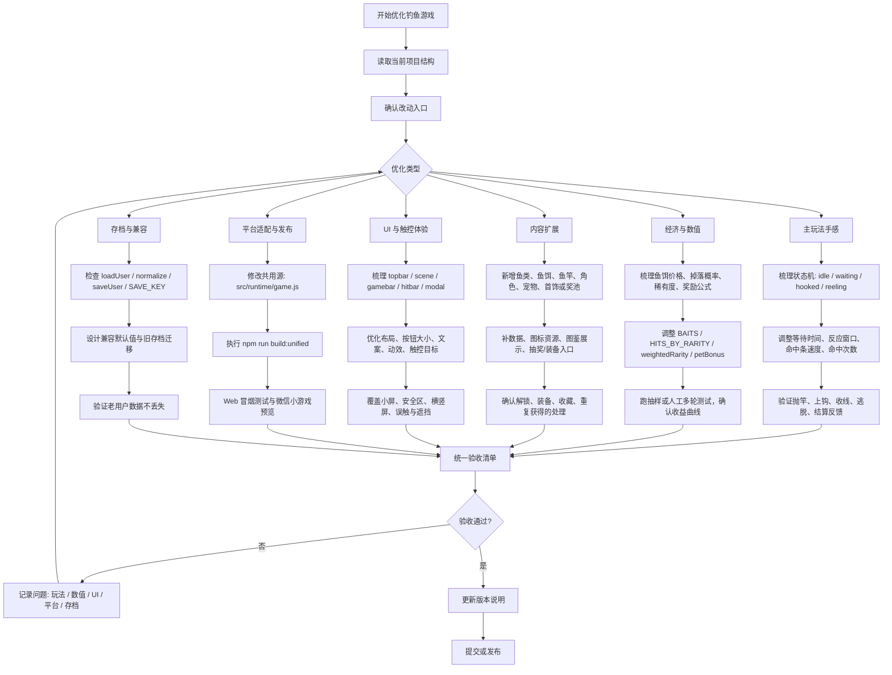
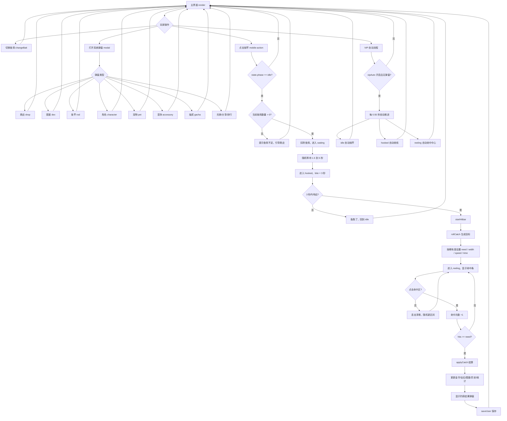
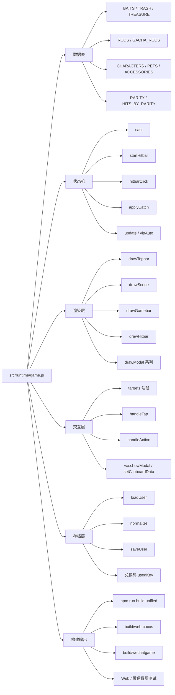
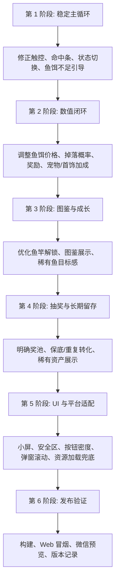

# 钓鱼游戏优化推进流程图

本文档基于当前 `fishgame-coco` 项目结构整理。当前 Web / 微信小游戏共用运行时集中在 `src/runtime/game.js`，Cocos 版本逻辑参考 `assets/scripts/FishingGame.ts` 与 `assets/scripts/game-data.ts`。

## 1. 总览流程

## 2. 主玩法状态机

## 3. 系统影响面

## 4. 推荐推进顺序

## 5. 每次优化的验收清单

- `npm run build:unified` 能成功生成 Web 与微信小游戏输出。
- 抛竿、上钩、收线、失败、成功结算都能走通。
- 鱼饵不足、金币不足、钻石不足都有明确反馈。
- 图鉴、鱼竿、角色、宠物、首饰、抽奖、兑换、分享入口不互相遮挡。
- 旧存档经过 `normalize` 后能继续使用，新字段有默认值。
- 小屏宽度下顶部按钮、鱼饵选择、命中按钮、弹窗内容不溢出。
- Web 版本与微信小游戏版本都基于同一个 `src/runtime/game.js` 源同步生成。
