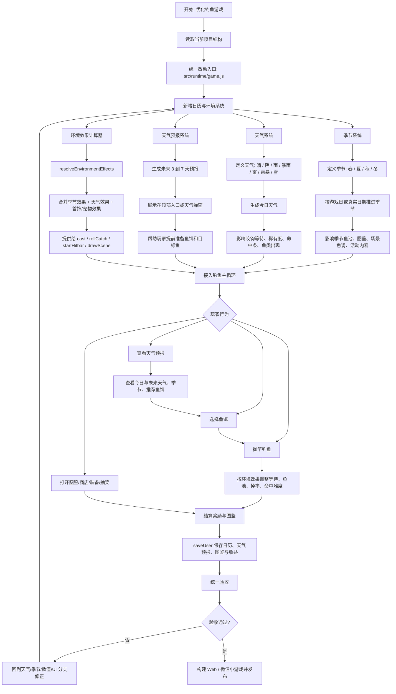
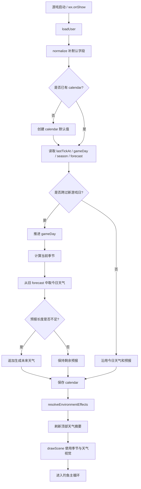
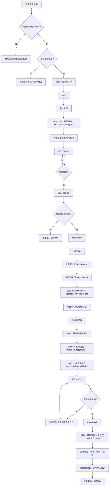
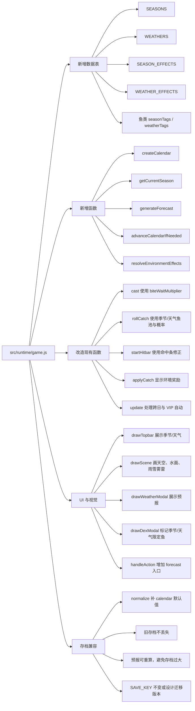
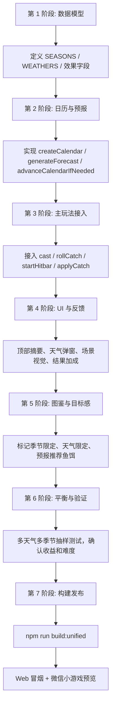

# 钓鱼游戏天气、天气预报与季节系统流程图

本文档是在现有 `fishgame-coco` 优化流程图基础上补充的新版本。目标是把“天气系统、天气预报、季节循环”接入当前钓鱼主循环，并明确它们对鱼池、掉率、等待时间、命中条、场景表现、UI 展示和存档兼容的影响。

## 1. 总览流程

## 2. 日历、季节与天气预报生成流程

## 3. 天气与季节对钓鱼主循环的影响

## 4. 新增数据结构与代码影响面

## 5. 推荐实现顺序

## 6. 天气与季节规则建议

| 系统 | 建议内容 | 影响点 |
|---|---|---|
| 春季 | 鱼类活跃、普通/稀有鱼略增 | 新手体验、图鉴收集 |
| 夏季 | 暴雨/雷暴概率更高，深水鱼出现 | 稀有鱼、隐藏鱼、场景表现 |
| 秋季 | 宝藏概率略增，鱼体重量略高 | 金币收益、目标感 |
| 冬季 | 雪天、雾天概率高，部分鱼休眠，冬季限定鱼出现 | 限定收集、等待时间 |
| 晴天 | 稳定基础天气 | 默认体验 |
| 阴天 | 等待略短，稀有度微增 | 平滑过渡 |
| 雨天 | 咬钩更快，稀有鱼概率提升 | 爽感与收益 |
| 暴雨 | 咬钩快但命中条更难 | 高风险高收益 |
| 大雾 | 稀有鱼略增但反应窗口更短 | 操作挑战 |
| 雷暴 | 隐藏鱼/宝藏概率提升，命中条更快 | 高价值事件 |
| 雪天 | 冬季鱼出现，等待变慢 | 季节限定 |

## 7. 验收清单

- 旧存档加载后自动补 `calendar`、`season`、`weather`、`forecast` 默认值。
- 今日天气和未来预报稳定，不会每次刷新都随机变化。
- 跨游戏日后会推进季节和天气，并补齐未来预报。
- 抛竿等待时间、鱼池筛选、稀有度、命中条速度、奖励文案都能体现天气/季节影响。
- 图鉴能区分普通鱼、天气限定鱼、季节限定鱼。
- 顶部信息和天气预报弹窗在小屏不遮挡主按钮。
- 雨、雪、雾、雷暴等场景效果有性能兜底，不影响低端设备帧率。
- `npm run build:unified` 后 Web 与微信小游戏输出一致。
